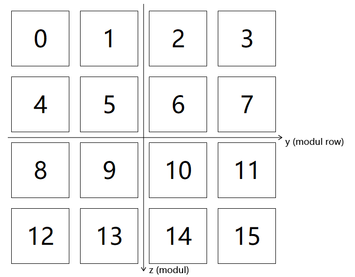

# PANDASimSD: A GEANT4 simulation of plastic scintillator antineutrino detector array

## Requirements
- **GEANT4: `11.2.1`**
- **CRY: `1.7`**

##  Run the Simulation
1. Execute the biniary file directly after compilement to run in interactive mode. `init_vis.mac` will be loaded automatically in this situation.

2. Execute the biniary file with input `*.mac` files to run in batch mode. Three `*.mac` files at most, see [**`detector`**](#i-detector) and [**`physics`**](#iii-physics) in [***Customized macro commands***](#customized-macro-commands).

## Spectra
`spectra` directory is for energy spectra storing. See [**`/source/spectra`**](#ii-source) in [***Customized macro commands***](#customized-macro-commands).

The spectrum format is showing below:

```
   Energy (MeV) | Relative intensity
```

> e.g. 0.0253 eV monoenergetic particle  

```
   2.53E-08  1
```

## Data Saving

`output` directory is for data storing.

5 numbers in file names denote 5 parameters: `absorptionLength`, `sigmaAlpha`, `rReflectivity`, `scintResol`, `PMTReflectivity` and `birksConstant`. Refer to [**`detector`**](#i-detector) in [***Customized macro commands***](#customized-macro-commands).

### I. Detector module numbering: 

> e.g. 4 × 4 array
> 
> 

### II. Binary (.data) files format (double of 8 bytes):

> 0 1 2 ... 14 15 0 1 2 ... 14 15 0 ...

- Files whos names contain `Right` or `Left` are the photo-electron data. The `*Right*.data` is exactly the same with the `*Left*.data`, in which both right and left PMT data are stored. 

  > 0R 0L 1R 1L ... 14R 14L 15R 15L 0R 0L ...

- The data shown below are not stored in form of the detector array.

  > betaKEHe8, betaKELi9, decayTimeHe8, decayTimeLi9, neutronGT, neutronKE, capTimeH, capTimeGd, muonKEPrimary, neutronKEPrimary

### III. Unit
- Time: `μs`  
- Energy deposition: `MeV`  
- Kenitic energy: `keV`  
- Primary kenitic energy: `GeV`
- Track length: `mm`

## Customized macro commands

### I. detector 

> Use this command ***before*** `/run/initialize`.  
  Use this command in the ***second or third*** input `*.mac` file, the first should be the one with `/run/initialize` and `/run/beamOn`.  
  This `*.mac` file is ***optional***. Without this file default detector setup wil be used. 
   
```
/detector/arraySize
/detector/detectorX
/detector/detectorY
/detector/detectorZ
/detector/moduleDistance
/detector/gdFilmThickness
/detector/addLabRoom
/detector/sigmaAlpha
/detector/rReflectivity
/detector/scintResol
/detector/PMTReflectivity
/detector/birksConstant
/detector/absorptionLength
```
 <!--
 /detector/update
```
-->

1. `/detector/arraySize`
   - Detector array size, a positive integer.
   - Default value: `4`.

2. `/detector/detectorX`
   - Detector X dimension, a positive double with unit (`cm` by default).
   - Default value: `10. cm`.

3.  `/detector/detectorY`
    - Detector Y dimension, a positive double with unit (`cm` by default).
    - Default value: `10. cm`.

4. `/detector/detectorZ`
   - Detector Z dimension, a positive double with unit (`cm` by default).
   - Default value: `100. cm`.

5. `/detector/moduleDistance`
   - Distance between modules, a positive double with unit (`cm` by default).
   - Default value: `2. cm`.

6. `/detector/gdFilmThickness`
   - Gd film thickness, a positive double with unit (`um`, μm, by default).
   - Default value: `30. um`.

7. `/detector/addLabRoom`
   - Available values: `true`/`false`.
   - Adding/removing lab room.
   - Default value: `true`.

8. `/detector/sigmaAlpha`
   - `sigma_alpha` of scintillator-reflector/PMT boundary, a non-negative double.
   - Default value: `0`.

9. `/detector/rReflectivity`
   - Reflection probability of scintillator-reflector boundary, range: [0, 1].
   - Default value: `1`.

10. `/detector/scintResol`
    - Scintillation yield resolution scale of the scintillator, a non-negative double.
    - Default value: `0`.

11. `/detector/PMTReflectivity`
    - Reflection probability of scintillator-PMT boundary, range: [0, 1].
    - Default value: `1`.

12. `/detector/birksConstant`
    - Birk's constant, a non-negative double in mm/MeV.
    - Default value: `0`.

13. `/detector/absorptionLength`
    - Absorption length of plastic scintillator, a positive double with unit (`cm` by default).
    - Default value: `380`.

<!--
8. `/detector/update`
   - Updating geometry after changing it, no parameter.
   - **DONOT USE!! BUG WITH SENSITIVE DETECTOR.**
-->

### II. source

> Use this command ***after*** `/run/initialize`

```
/source/type              
/source/spectra     
/source/position          
/source/neutrinoPosition
```

1. `/source/type`
   - Available values: `Cs137`/`Co60`/`Na22`/`Cs137g`/`Co60g`/`Am-Be-n`/`GUN`/`He8`/`Li9`/`NEUTRINO`/`MUON`/`COSMICNEUTRON`/`CRY` (Linux only)/`GPS`.
   - `Cs137`/`Co60`/`Na22`/`Cs137g`/`Co60g`/`Am-Be-n`/`GUN` with position `CENTER`/`EDGE`;  
     `GUN` with position `INSIDE` or `COMMAND` (means defined by UI command `/gun/position`). Energy, momentum, particle etc. must be defined with source `GUN` using UI command `/gun/**`.  
     Position, momentum, particle etc. must be defined with source `GPS` using UI command `/gps/**`.
   - Default value: `NEUTRINO`.

2. `/source/spectra`
   - Spectra of neutron and positron, two strings at most. See spectra directory.  
     First one should be spectrum of neutron.  
     Second one, if there is, should be spectrum of positron.
   - Command is valid only for `NEUTRINO`, `Am-Be-n` and `COSMICNEUTRON`.
   - Default value: `IBDNeutron.spec IBDPositron.spec`.

3. `/source/position`
   - Available values: `CENTER`/`EDGE`/`INSIDE`/`COMMAND`
   - Position for `Cs137`/`Co60`/`Na22`/`Cs137g`/`Co60g`/`Am-Be-n`/`GUN`  
     Direction must be defined for `GUN` with position `CENTER`/`EDGE`.  
     Direction and position must be defined for `GUN` with position `COMMAND`.  
     Direction is isotropic for `GUN` with position `INSIDE`.
   - Default value: `CENTER`.

4. `/source/neutrinoPosition`
   - Position for `NEUTRINO`, two positive integers [0 - size × size, 0 - 5].  
    First integer is position in the detector array, size × size means random.  
    Second integer is position in the detector module, 5 means random.  
    Second integer is valid only when arrayPosition < size × size.
   - Default value: `size × size 5`.

### III. physics

> Use this command in the ***second or third*** input `*.mac` file, the first should be the one with `/run/initialize` and `/run/beamOn`.  
  This `*.mac` file is ***optional***. Without this file optical process and muonic atom decay process will be ***off***. 

```
/physics/optical
/physics/muonicDecay
```

1. `/physics/optical`
   - Available values: `true`/`false`.
   - Turning on/off optical process.
   - Default value: `true`.

2. `/physics/muonicDecay`
   - Available values: `true`/`false`.
   - Turning on/off muonic atom decay process.
   - Default value: `true`.

### IV. time

> Use this command ***after*** `/run/initialize`

```
/time/timeInterval
```

1. `/time/timeInterval`
   - Time interval between parent particle and secondaries, a positive double with unit (`us`,  μs, by default).
   - If time interval between parent particle and secondaries is bigger than this value, they will be treated as two signals.
   - Default value: `1. us`.